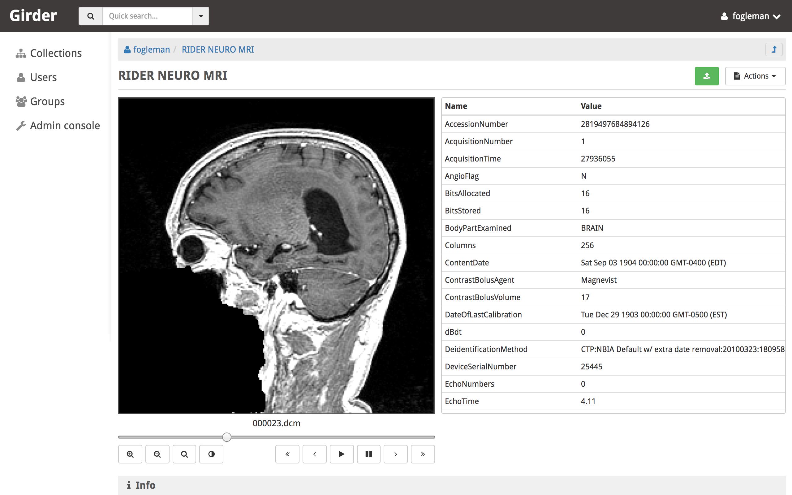

.. _plugins:

Plugins
=======

One of the most useful aspects of the Girder platform is its ability to be extended in
almost any way by custom plugins. Developers looking for information on writing
their own plugins should see the :ref:`Plugin Development <plugindevelopment>` section. Below is
a listing and brief documentation of some of Girder's standard plugins that come
pre-packaged with the application.

Authorized Uploads
------------------

This plugin allows registered users to grant access to others to upload data on their behalf
via a secure URL. The secure URL allows a third party to upload a single file into the selected
folder, even if that third party does not have a registered user in Girder.

To authorize an upload on behalf of your user:

1. Navigate into any folder to which you have write access. From the **Folder actions** dropdown
   menu on the right, choose **Authorize upload here**. You will be taken to a page that allows generation
   of a secure, single-use URL. You can optionally specify a number of days until the URL expires; if none
   is specified, the user session lifetime is used, which defaults to 180 days.
2. Click **Generate URL**, and your secure URL will appear below.
3. Copy that URL and send it to the third party, and they will be taken to a simple page allowing them
   to upload the file without having to see any details of the normal Girder application.

.. note::

  When an upload is authorized, it's authorized into a particular folder, and inherits the access control
  configured on that folder.

.. _jobsplugin:

Jobs
-----------

The jobs plugin is useful for representing long-running (usually asynchronous) jobs
in the Girder data model. Since the notion of tracking batch jobs is so common to
many applications of Girder, this plugin is very generic and is meant to be an
upstream dependency of more specialized plugins that actually create and execute
the batch jobs.

The job resource that is the primary data type exposed by this plugin has many
common and useful fields, including:

- ``title``: The name that will be displayed in the job management console.
- ``type``: The type identifier for the job, used by downstream plugins opaquely.
- ``args``: Ordered arguments of the job (a list).
- ``kwargs``: Keyword arguments of the job (a dictionary).
- ``created``: Timestamp when the job was created
- ``progress``: Progress information about the job's execution.
- ``status``: The state of the job, e.g. Inactive, Running, Success.
- ``log``: Log output from this job's execution.
- ``handler``: An opaque value used by downstream plugins to identify what should
  handle this job.
- ``meta``: Any additional information about the job should be stored here by
  downstream plugins.

Jobs should be created with the ``createJob`` method of the job model. Downstream
plugins that are in charge of actually scheduling a job for execution should then
call ``scheduleJob``, which triggers the ``jobs.schedule`` event with the job
document as the event info.

The jobs plugin contains several built-in status codes within the
``girder.plugins.jobs.constants.JobStatus`` namespace. These codes represent
various states a job can be in, which are:

- INACTIVE (0)
- QUEUED (1)
- RUNNING (2)
- SUCCESS (3)
- ERROR (4)
- CANCELED (5)

Downstream plugins that wish to expose their own custom job statuses must hook
into the ``jobs.status.validate`` event for any new valid status value, which by convention
must be integer values. To validate a status code, the default must be prevented
on the event, and the handler must add a ``True`` response to the event. For example, a
downstream plugin with a custom job status with the value *1234* would add the following hook:

.. code-block:: python

    from girder import events

    def validateJobStatus(event):
        if event.info == 1234:
            event.preventDefault().addResponse(True)

    def load(info):
        events.bind('jobs.status.validate', 'my_plugin', validateJobStatus):

Downstream plugins that want to hook into job updates must use a different convention than normal;
for the sake of optimizing data transfer, job updates do not occur using the normal ``save`` method
of Girder models. Therefore, plugins that want to listen to job updates should bind to either
``jobs.job.update`` (which is triggered prior to persisting the updates and can be used to prevent
the update) or ``jobs.job.update.after`` (which is triggered after the update). Users of these events
should be aware that the ``log`` field of the job will not necessarily be in sync with the persisted
version, so if your event handler requires access to the job log, you should manually re-fetch the
full document in the handler.

Geospatial
----------

TODO: Add migration notice

Google Analytics
----------------

The Google Analytics plugin enables the use of Google Analytics to track
page views with the Girder one-page application. It is primarily a client-side
plugin with the tracking ID stored in the database. Each routing change will
trigger a page view event and the hierarchy widget has special handling (though
it does not technically trigger routing events for hierarchy navigation).

To use this plugin, simply copy your tracking ID from Google Analytics into the
plugin configuration page.

Homepage
--------

The Homepage plugin allows the default Girder front page to be replaced by
content written in `Markdown <https://daringfireball.net/projects/markdown/>`_
format. After enabling this plugin, visit the plugin configuration page
to edit and preview the Markdown.

Auto Join
---------

The Auto Join plugin allows you to define rules to automatically assign new
users to groups based on their email address domain. Typically, this is used in
conjunction with email verification.

When a new user registers, each auto join rule is checked to see if the user's
email address contains the rule pattern as a substring (case insensitive).

If there is a match, the user is added to the group with the specified access
level.

Download Statistics
-------------------

This plugin tracks and records file download activity. The recorded information
(downloads started, downloads completed, and total requests made) is stored on the
file model: ::

    file['downloadStatistics']['started']
    file['downloadStatistics']['requested']
    file['downloadStatistics']['completed']

DICOM Viewer
------------

The DICOM Viewer plugin adds support for previewing DICOM files when viewing
an item in girder. If multiple DICOM files are present in a single item, they
are presented as multiple slices. The DICOM image is shown as well as a table
of DICOM tags. The window center and width can be changed by the user. Controls
allow the user to step through slices, auto-level the window, auto-zoom, or
playback the slices at different speeds.

This plugin parses the DICOM tags when files are uploaded and stores them in
the MongoDB database for quick retrieval. This is mostly used to sort multiple
images by series and instance.

    DICOM imagery from: https://wiki.cancerimagingarchive.net/display/Public/RIDER+NEURO+MRI

LDAP Authentication
-------------------

This plugin allows administrators to configure the server so that users can
log in against one or more LDAP servers. If the user fails to authenticate to
any of the available LDAP servers, they will fall back to normal core
authentication. Documentation of the LDAP standard in general can be found
`here <https://en.wikipedia.org/wiki/Lightweight_Directory_Access_Protocol>`_.

Administrators can configure the ordered list of LDAP servers to try on the
plugin configuration page. Each server in the list has several properties:

* **URI**: The URI of the LDAP server. Example: ``ldaps://my.ldap.org:636``.
* **Bind name**: The Distinguished Name (DN) to use when connecting to the LDAP
  server to perform directory searches. Example: ``cn=me,cn=Users,dc=my,dc=ldap,dc=org``.
* **Password**: (Optional) The password to use when connecting to the LDAP server
  to perform directory searches.
* **Base DN**: The Distinguished Name (DN) under which to search for users
  during login. Example: ``cn=Users,dc=my,dc=ldap,dc=org``.
* **Search field**: (Optional) This specifies what field should be searched
  in the directory for the login field entered by the user. The default value is
  the ``uid`` field, though some implementations would want to use, e.g. ``mail``.
  It is assumed that the search field will uniquely identify at most one user
  in the directory under the Base DN.

.. note:: This plugin is known to work against LDAP version 3. Using it with
  older versions of the protocol might work, but is not tested at this time.

OAuth Login
-----------

This plugin allows users to log in using OAuth against a set of supported providers,
rather than storing their credentials in the Girder instance. Specific instructions
for each provider can be found below.

By using OAuth, Girder users can avoid registering a new user in Girder, leaving it
up to the OAuth provider to store their password and provide details of their
identity. The fact that a Girder user has logged in via an OAuth provider is stored
in their user document instead of a password. OAuth users who need to authenticate
with programmatic clients such as the girder-client python library should use
:ref:`API keys <api_keys>` to do so.

Google
******

On the plugin configuration page, you must enter a **Client ID** and **Client secret**.
Those values can be created in the Google Developer Console, in the **APIS & AUTH** >
**Credentials** section. When you create a new Client ID, you must enter the
``AUTHORIZED_JAVASCRIPT_ORIGINS`` and ``AUTHORIZED_REDIRECT_URI`` fields. These *must*
point back to your Girder instance. For example, if your Girder instance is hosted
at ``https://my.girder.com``, then you should specify the following values: ::

    AUTHORIZED_JAVASCRIPT_ORIGINS: https://my.girder.com
    AUTHORIZED_REDIRECT_URI: https://my.girder.com/api/v1/oauth/google/callback

After successfully creating the Client ID, copy and paste the client ID and client
secret values into the plugin's configuration page, and hit **Save**. Users should
then be able to log in with their Google account when they click the log in page
and select the option to log in with Google.

Extension
*********

This plugin can also be extended to do more than just login behavior using the
OAuth providers. For instance, if you wanted some sort of integration with a
user's Google+ circles, you would add a custom scope that the user would have
to authorize during the OAuth login process.

.. code-block:: python

    from girder.plugins.oauth.providers.google import Google
    Google.addScopes(['https://www.googleapis.com/auth/plus.circles.read'])

Then, you can hook into the event of a user logging in via OAuth. You can
hook in either before the Girder user login has occurred, or afterward. In
our case, we want to do it after the Girder user has been fetched (or created,
if this is the first time logging in with these OAuth credentials).

.. code-block:: python

    def readCircles(event):
        # Read user's circles, do something with them
        if event.info['provider'] == 'google':
            token = event.info['token']
            user = event.info['user']
            ...

    from girder import events
    events.bind('oauth.auth_callback.after', 'my_plugin', readCircles)

.. note:: If ``event.preventDefault()`` is called in the event handler for
  ``oauth.auth_callback.before`` or ``oauth.auth_callback.after``, the OAuth
  callback does not create a new Girder Token, nor sets a new authentication
  cookie.

Gravatar Portraits
------------------

This lightweight plugin makes all users' Gravatar image URLs available for use
in clients. When enabled, user documents sent through the REST API will contain
a new field ``gravatar_baseUrl`` if the value has been computed. If that field
is not set on the user document, instead use the URL ``/user/:id/gravatar`` under
the Girder API, which will compute and store the correct Gravatar URL, and then
redirect to it. The next time that user document is sent over the REST API,
it should contain the computed ``gravatar_baseUrl`` field.

Terms of Use
------------

This plugin allows collection admins to define a set of textual "Terms of Use", which other users
must accept before browsing within the collection. The terms may be set with markdown-formatted
text, and users will be required to re-accept the terms whenever the content changes. Logged-in
users have their acceptances stored and remembered permanently, while anonymous users have their
acceptances stored only on the local browser.

Javascript clients
******************

The Gravatar plugin's javascript code extends the Girder web client's ``girder.models.UserModel``
by adding the ``getGravatarUrl(size)`` method that adheres to the above behavior
internally. You can use it on any user model with the ``_id`` field set, as in the following example:

.. code-block:: javascript

    import { getCurrentUser } from '@girder/core/auth';

    const currentUser = getCurrentUser();
    if (currentUser) {
        this.$('div.gravatar-portrait').css(
            'background-image', `url(${currentUser.getGravatarUrl(36)})`);
    }

.. note:: Gravatar images are always square; the ``size`` parameter refers to
   the side length of the desired image in pixels.

Remote Worker
-------------

This plugin should be enabled if you want to use the Girder worker distributed
processing engine to execute batch jobs initiated by the server. This is useful
for deploying service architectures that involve both data management and
scalable offline processing. This plugin provides utilities for sending generic tasks
to worker nodes for execution. The worker itself uses
`celery <http://www.celeryproject.org/>`_ to manage the distribution of tasks,
and builds in some useful Girder integrations on top of celery. Namely,

* **Data management**: This plugin provides python functions for building task
  input and output specs that refer to data stored on the Girder server, making
  it easy to run processing on specific folders, items, or files. The worker itself
  knows how to authenticate and download data from the server, and upload results
  back to it.
* **Job management**: This plugin depends on the :ref:`Jobs plugin <jobsplugin>`.
  Tasks are specified as python dictionaries inside of a job document and then
  scheduled via celery. The worker automatically updates the status of jobs
  as they are received and executed so that they can be monitored via the jobs
  UI in real time. If the script prints any logging information, it is automatically
  collected in the job log on the server, and if the script raises an exception,
  the job status is automatically set to an error state.

Hashsum Download
----------------

The hashum_download plugin allows a file to be downloaded from Girder given a hash value and hash
algorithm. Use this plugin when you have large data that you don’t want to keep in a software
repository, but want to access that data from the repository, e.g. during a build or test of that
software project. This plugin is written to satisfy the needs of CMake ExternalData. These docs
describe how to use this plugin along with ExternalData, but the plugin could be used outside of
that context. For more detailed documentation on how to use this in a software repository see the
`ITKExamples <https://itk.org/ITKExamples/Documentation/Contribute/UploadBinaryData.html>`_. This
example project uses the Girder instance https://data.kitware.com.

.. note:: The use of the hashsum_download plugin with CMake ExternalData is only supported with a
   filesystem assetstore and SHA512 as the hash algorithm.

As every local Git repository contains a copy of the entire project history, it is important to
avoid adding large binary files directly to the repository. Large binary files added and removed
throughout a project’s history will cause the repository to become bloated and take up too much
disk space, requiring excessive time and bandwidth to download.

A solution to this problem, when using the CMake build system, is to store binary files in a
separate location outside the Git repository, then download the files at build time with CMake.

CMake uses the notion of a content link file, which contains an identifying hash calculated from
the original data file. The content link file has the same name as the data file, with a ".sha512"
extension appended to the file name, and should be stored in the Git repository. CMake will find
these content link files at build time, download the corresponding data files from a list of server
resources, and create symlinks or copies of the original files in the build tree, which is why the
files are called "content links".

What CMake calls a content link file, Girder calls a key file, as the notion of content link
doesn't apply in the context of Girder, and the hash value is a key into the original data file.
When using the hashsum_download plugin, the data file is stored in Girder, with the SHA512 for the
data added as metadata and provided as the key file, which can be downloaded from Girder and added
to a project repository. The hashsum_plugin allows the data file to be downloaded based on the hash
of the data. CMake ExternalData provides tooling to connect with a Girder instance, download the
actual data file pointed to by the content link (key) file by passing the hash to Girder, and
provide a local file path to access the data file contents.

Sentry
----------------

The Sentry plugin enables the use of `Sentry <https://sentry.io>`_ to detect and report errors in Girder.

Usage by a software project maintainer
**************************************

Again, for more background, using the example Girder instance https://data.kitware.com, see the
`ITKExamples <https://itk.org/ITKExamples/Documentation/Contribute/UploadBinaryData.html>`_. Also
see the CMake External Data documentation for CMake project configuration
`help <https://cmake.org/cmake/help/latest/module/ExternalData.html>`_.

In your project, you must set ExternalData_URL_TEMPLATES to a girder url, e.g.
"https://data.kitware.com/api/v1/file/hashsum/%(algo)/%(hash)/download".

See the ITK configuration for an `example <https://github.com/InsightSoftwareConsortium/ITKExamples/blob/master/CMake/ITKExamplesExternalData.cmake>`_
application of ExternalData_URL_TEMPLATES.

Project contributors will add data files to a Girder instance in arbitrary folders. At a project
release and on a regular basis, perhaps nightly, the data should be archived in a new Girder folder
to ensure its persistence.  A `script <https://github.com/InsightSoftwareConsortium/ITK/blob/ef14cce1c26d5dce7eb2e10d36c7dc81aaa9c9e8/Utilities/Maintenance/ArchiveTestingDataOnGirder.py>`_ that provides this functionality is available, as is an
`example folder <https://data.kitware.com/#collection/57b5c9e58d777f126827f5a1/folder/57b672b48d777f10f269651a>`_
produced by the script for a release.

Usage by a software project contributor
***************************************

Upload a file to a Girder instance, which will create a Girder Item to house the file. Navigate to
the Item, then click on the **i** (information) icon next to the file, which will show the id, and
since the hashsum_download plugin is enabled, the sha512 field will also be displayed. Click on the
key icon to download a hashfile, which will be the full sha512 of the file, with the same name as
the file, and an extension of .sha512, and you can use this key file as your CMake content link.
E.g., upload my_datafile.txt and download the my_data.txt.sha512 file, then check the
my_data.txt.sha512 file into your source repository.

You can use the Girder API to get the hash of the file given the file id, with the endpoint
``api/v1/file/<file id>/hashsum_file/sha512``, where the file id comes from the specific file in
Girder.

You can also use the API to download the file based on the hash returned by the previous endpoint,
with an endpoint ``/api/v1/file/hashsum/sha512/<file sha512 hash>/download``, where the sha512 hash
comes from the specific file in Girder.
